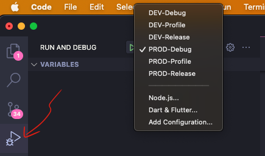
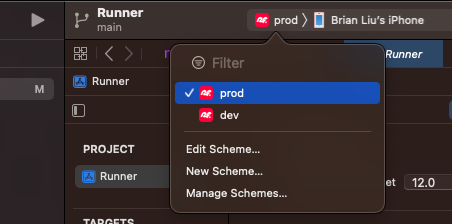
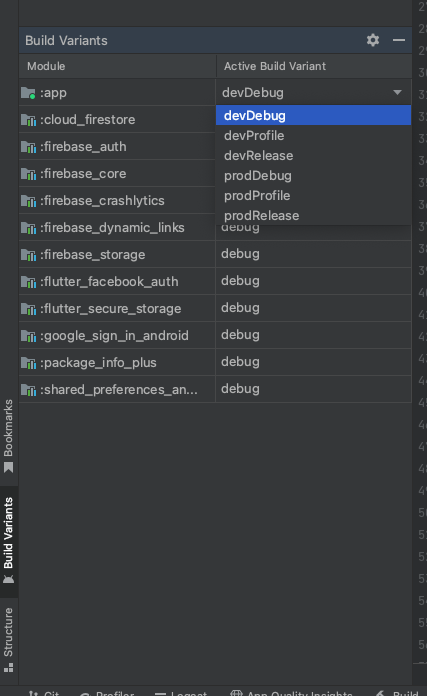

<a href="https://www.redflagsdating.com/">
  <h1 align="center">
    <picture>
      <source media="(prefers-color-scheme: dark)" srcset="docs/redflags-180.png">
      
    </picture>
    <div>
      Red Flags Dating App
    </div>
  </h1>
</a>

- [Technologies](#technology)
- [Folder Structure](#folder-structure)
- [Getting Started](#getting-started)
- [Developer Guide](#developer-guide)

## Technology

- [Flutter](https://docs.flutter.dev/)
- [Dart](https://dart.dev/)
- [Firebase](https://firebase.google.com/)

## Folder Structure

```yml
    .
    ├── lib/                               # Source code folder
    │   ├── main_dev.dart                 # Flutter DEV target
    │   ├── main_prod.dart                # Flutter PROD target
    │   ├── firebase_options_dev.dart     # Firebase DEV config
    │   ├── firebase_options_prod.dart    # Firebase PROD config
    │   ├── app.dart                      # App widget 
    │   ├── models/                       # Data models (Domain layer)
    │   │   ├── user.dart
    │   │   └── ...
    │   ├── widgets/                      # Flutter widgets (Presentation layer)
    │   │   ├── page_home.dart
    │   │   ├── page_signin.dart
    │   │   ├── mixin_snackbar.dart
    │   │   └── ...
    │   ├── services/                     # (Application layer)
    │   │   ├── auth_provider.dart
    │   │   ├── logger_provider.dart
    │   │   └── ...       
    │   └── ...        
    │         
    ├── test/                              # Widget tests
    │   ├── test_widget.dart       
    │   └── ... 
    │                
    ├── docs/                              # Documentation
    │   ├── flutter/   
    │   ├── firebase/     
    │   ├── ios/     
    │   ├── android/                  
    │   └── ... 
    │  
    ├── pubspec.lock                      # Flutter/Dart package dependency lock file
    ├── pubspec.yaml                      # Flutter/Dart package dependency file
    ├── ios                               # iOS Xcode project
    ├── android                           # Android Studio project
    ├── .vscode                           # VS Code workspace settings 
    ├── .githooks                         # Hoist .git/hooks folder for source control             
    └── ...
```

Inside the source folder `lib/` follows ***Layer-first*** structure, see [Feature-first vs Layer-first](https://github.com/bizz84/flutter-tips-and-tricks/blob/main/tips/0039-flutter-project-structure-feature-first-or-layer-first/index.md).


## Getting Started

- [Install](#install)
- [Setup](#setup)
- [Run](#run)

### Install

#### git CLI

`git` CLI comes with `Xcode` on Mac by default, follow [Git Guide](https://github.com/git-guides/install-git) to install on other machines.

#### VS Code

For better DX and seamless onboarding experience, [VS Code](https://code.visualstudio.com/download) is the primary IDE for the Dev team to ensure you have all the essential plugins, settings and tools from the repository to start developing.

[Download VS Code](https://code.visualstudio.com/download)

> Using the same IDE across the Dev team saves your time on trouble shooting compatibility issues and maximize sharable knowledge/experience with the same language in the team.

#### Flutter

Follow [the Flutter official guide](https://docs.flutter.dev/get-started/install) to install required software and setup for `iOS` and `Android` platforms only.

#### Firebase CLI

Follow [the Firebase official installation guide](https://firebase.google.com/docs/cli?authuser=0#setup_update_cli).

### Setup

- *Clone the repo*
- *Install dependent packages*
- *Change Git Hooks path*
- *Config `git` user info*

```bash
# Clone the repo
git clone git@github.com:redflagsdating/rfd-app.git
```

```bash
# Install dependent packages
cd rfd-app
flutter pub get
```

```bash
# Change Git Hooks path
git config core.hooksPath .githooks/
```

```bash
# Config git user info
git config --global user.name "John Smith"
git config --global user.email john@redflagsdating.com
```

### Run

**Three** ways to launch the app locally:

1. VS Code
2. Terminal
3. Xcode/Android Studio

Note that `dev` and `prod` are two separated **Firebase** environments with different [flavor](https://docs.flutter.dev/deployment/flavors#what-are-flavors) settings, ensure you launch the right ***flavor*** with the corresponding ***target*** for different purposes.

#### via **VS Code**

Locate the **VS Code** status bar at the bottom right and select a device (*iOS or Android*) from the ***Device Selector*** area (see [Run the app](https://docs.flutter.dev/get-started/test-drive)) then click ***Run and Debug*** > select the build flavor > ***Run***. 



> You can connect your **iOS/Android** devices via USB and it should show up on your **VS Code** available devices.

> You also have both **iOS** and **Android** simulators on your **VS Code** available devices if you have followed the [the Flutter official guide](https://docs.flutter.dev/get-started/install).

#### via **Terminal**

For day-to-day development, run `dev` in **Debug** mode

```bash
flutter run --flavor dev --target lib/main_dev.dart
```

`dev` in other modes

```bash
flutter run --flavor dev --target lib/main_dev.dart --profile
flutter run --flavor dev --target lib/main_dev.dart --release
```

vice versa for `prod`

```bash
flutter run --flavor prod --target lib/main_prod.dart
...
```

#### via Xcode/Android Studio

For **Xcode**, click the current scheme icon then select either `dev` or `prod` scheme then ***Product > Run***.



For **Android Studio**, click ***Build Variants*** at the bottom-left panel > select the variant of `app` from the dropdown > ***Run***.



## Developer Guide

- ***DX*** *(Developer eXperience)*
- ***Flutter***
  - [Cheat sheet](/docs/flutter/cheat-sheet.md)
  - [Environments](/docs/flutter/environments.md)
  - [Testing](/docs/flutter/testing.md)
  - [Logging](/docs/flutter/logging.md)
- ***Firebase***
  - [Cheat sheet](/docs/firebase/cheat-sheet.md)
  - [Environments](/docs/firebase/environments.md)
  - [Authentication](/docs/firebase/authentication.md)
  - [Crashlytics](/docs/firebase/crashlytics.md)
  - [Analytics](/docs/firebase/analytics.md)
- ***Android***
  - [Cheat sheet](/docs/android/cheat-sheet.md)
  - [Environments](/docs/android/environments.md)
- ***iOS***
  - [Cheat sheet](/docs/ios/cheat-sheet.md)
  - [Environments](/docs/ios/environments.md)
