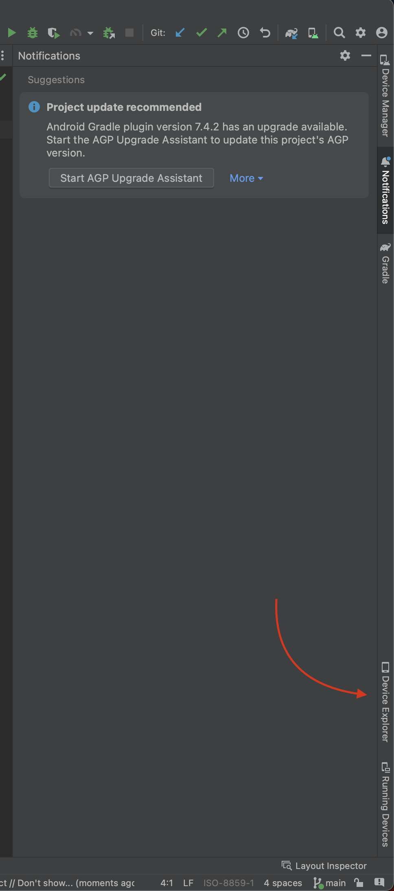
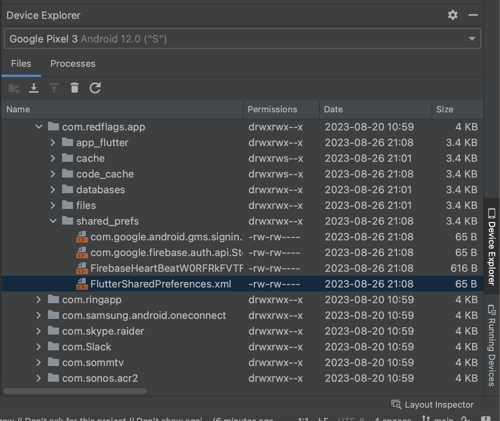

# Android cheat sheet

- [List of device permissions](https://github.com/Baseflow/flutter-permission-handler/blob/main/permission_handler/example/android/app/src/main/AndroidManifest.xml)
- [Change the app icon](#change-the-app-icon)
- [View & debug shared preferences (local storage)](#view-and-debug-shared-preference)
- [Image crop](#image-crop)
- [Build & Publish](#build--publish)
- [Firebase App Check](/docs/firebase/app-check.md#android)

## Change the app icon

You will use a tool in Android Studio, called **Image Asset Studio**, to generate different versions of the launcher icons.

Open the repo folder in Android Studio, then switch to **Project** view


Locate `android/app/src/main/res` and right click on `res/` folder, then `New > Image Asset`. Change the `Path` to the new icon image file then Asset Studio will automatically generate all versions for icons. See [the codelab guide](https://developer.android.com/codelabs/basic-android-kotlin-compose-training-change-app-icon?hl=en#4) for more details.


## View and debug shared preference

To view or debug local storage data (via `SharedPreferences` library), open **Android Studio** > ***Device Explorer*** > `data/data/com.redflags.app.dev/FlutterSharedPreferences.xml`.




## Image crop

`image_cropper` requires to add below snippet in the `AndroidManifest.xml`

```xml
 <activity
    android:name="com.yalantis.ucrop.UCropActivity"
    android:screenOrientation="portrait"
    android:theme="@style/Theme.AppCompat.Light.NoActionBar"/>
```

## Build & Publish

Bump the bundle version in `pubspec.yaml`

```yaml
# {version}+{build number}
version: 0.0.2+3
```

Build for production release

```bash
flutter build appbundle --flavor prod --target lib/main_prod.dart
```

Output bundle file `build/app/outputs/bundle/prodRelease/app-prod-release.aab`. For internal testing, you can upload directly via https://play.google.com/console/internal-app-sharing. 

See more options in the [official guide](https://docs.flutter.dev/deployment/android).