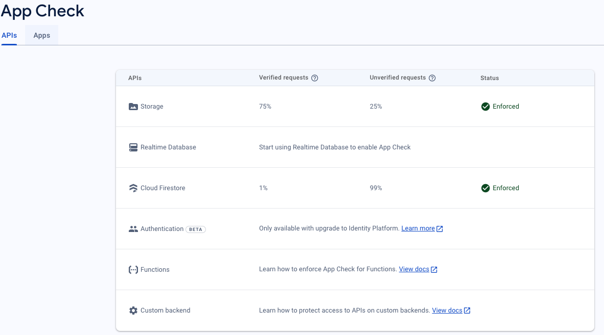
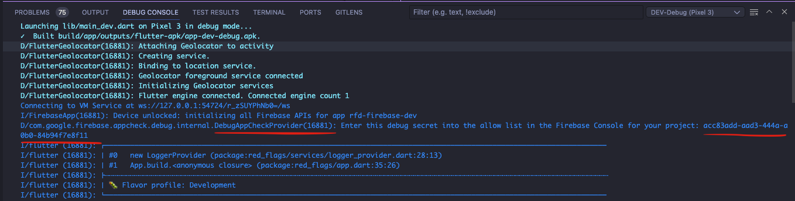
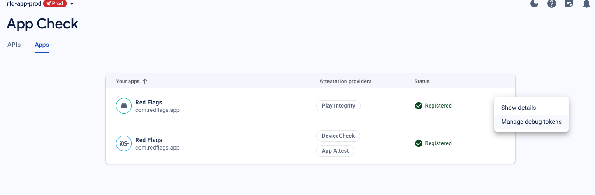

# Firebase App Check

- [Setup](#setup)

App Check helps protect our Firebase service/API resources from abuse by preventing unauthorized clients from accessing your backend resources. It works with both Firebase services, Google Cloud services, and your own APIs to keep your resources safe.

It is also required by **FirebaseAuth** to perform security-sensitive operations such as `FirebaseAuth.instance.currentUser.delete()`.



## Setup

Install `firebase_app_check` package

```bash
flutter pub add firebase_app_check
```

Initialize **App Check** in both `main_dev.dart` and `main_prod.dart` files and must below `Firebase.initializeApp`.

```dart
  //** Firebase init */
  await Firebase.initializeApp(
    // Unique name is required to avoid using "Default" and clash with prod
    name: 'rfd-firebase-dev',
    options: DefaultFirebaseOptions.currentPlatform,
  );

  // ** Firebase App Check */
  await FirebaseAppCheck.instance.activate(
    androidProvider:
        kDebugMode ? AndroidProvider.debug : AndroidProvider.playIntegrity,
    appleProvider: kDebugMode ? AppleProvider.debug : AppleProvider.deviceCheck,
  );
  ```

  Use `AndroidProvider.debug` and `AppleProvider.debug` providers for development, the ***Debug token*** will be printed out in the console every time you run the app. You will need copy the debug token and paste it into Firebase App Check console for [iOS](#ios) and [Android](#android) respectively.



### Android

#### Debug

Copy the [debug token from the console as above](#setup), go to [Firebase App Check console](https://console.firebase.google.com/project/rf-app-dev-7145f/appcheck/products) > ***Apps*** > ***Manage debug tokens***, paste to add a new debug token.



#### Play Integrity

Follow [step 2, 3](https://firebase.google.com/docs/app-check/android/play-integrity-provider#project-setup) to set up for production build.


### iOS

See [Debug](#debug) setting to add debug token for iOS.

#### DeviceCheck

Follow [step 2, 3](https://firebase.google.com/docs/app-check/ios/devicecheck-provider#project-setup) to set up for production build.
