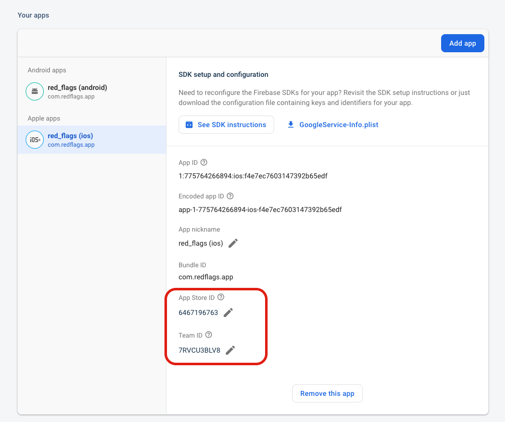
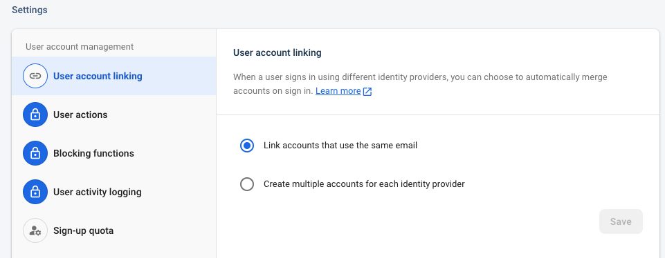
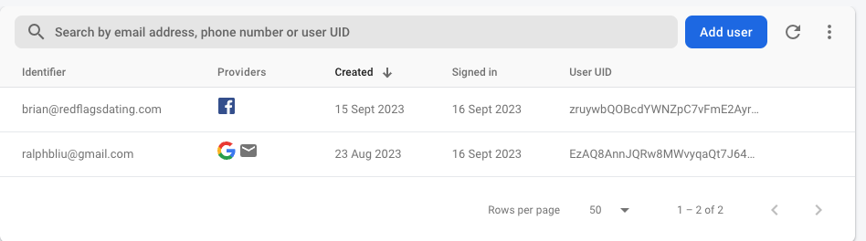

# Firebase Authentication

- [AuthProvider](#authprovider)
- [Link accounts](#link-accounts)

## AuthProvider

`AuthProvider` is injected into the context in `lib/app.dart` for using across the entire app, check out `lib/services/auth_provider.dart` for technical details.

In order for `AuthProvider` to work on both Android and iOS, follow the guides below to set up your machine

- [Google Sign-In setup guide](#google-sign-in)
- [Facebook Sign-In setup guide](#facebook-sign-in)
- [Email Link Sign-In setup guide](#email-link-sign-in)

### Google Sign-In

- [Set up SHA1 key](#sha1-key) *(Android Only)*
- [Set up client id](#set-up-client-id) *(iOS Only)*

> See [Federated identity & social sign-in](https://firebase.google.com/docs/auth/flutter/federated-auth#google) doc for more insight

#### `SHA1 key`

You need to ensure your machine's **SHA1** key has been configured on Firebase for using Google Sign-In with Android. There are [few different ways](https://developers.google.com/android/guides/client-auth) to get the **SHA1** of your signing certificate and using **Gradle** `signingReport` command is the easiest way for development purpose.

Open the repository in **Android Studio**, click on ***Gradle*** tab on the top-right


Click ***Execute Gradle Task*** icon


Manually type in command `gradlew signingReport` then press *Enter* then you should see different variants of certificates are output on the console as below.


Find ***Any*** **Config: debug** and copy the **SHA1** for the `rfd-app-dev` Firebase project

```sh
Starting Gradle Daemon...
Gradle Daemon started in 1 s 481 ms

> Task :app:signingReport
Variant: debug
Config: debug
Store: /Users/brianliu/.android/debug.keystore
Alias: AndroidDebugKey
MD5: FE:AD:C8:13:18:F8:38:BC:B0:28:05:D4:58:28:9E:D7
SHA1: FB:D8:A5:06:4D:1F:B8:C0:5D:12:AD:B4:E3:47:F4:B1:FB:E5:82:5C
SHA-256: A4:B4:54:21:51:31:0A:E5:EC:36:27:95:1F:6D:CF:A1:9A:DB:9E:BF:32:BD:C4:A4:16:74:CD:1B:E1:11:1B:87
Valid until: Saturday, 26 July 2053
```

and ***Any*** **Config: release** then copy the **SHA1** for the `rfd-app-prod` Firebase project

```sh
Variant: prodRelease
Config: release
Store: /Users/brianliu/.android/upload-keystore.jks
Alias: upload
MD5: 8F:04:51:16:DB:85:91:E7:E5:6A:39:39:E1:2E:55:E3
SHA1: 3B:11:2F:4B:B7:0B:D5:6F:18:63:3F:89:55:63:61:18:A4:3A:DB:E8
SHA-256: 46:FC:C7:77:7B:41:48:26:64:70:7F:B6:C1:5B:F8:4A:77:10:1A:21:09:D6:57:31:53:54:E2:34:9F:E2:4B:CE
Valid until: Thursday, 24 September 2048
```

Go to **Firebase** console > ***Project settings*** > ***Add fingerprint*** then paste the **SHA1** key then save.


#### `Set up client id`

You can run `flutterfire configure` command to automatically update all the configurations (see [Sync Firebase configuration](../firebase/cheat-sheet.md#sync-firebase-configuration)) and only follow the below steps to manually check if you have problems to run Google Sign-In on iOS devices.


Open `ios/config/dev/GoogleService-Info.plist` or `ios/config/prod/GoogleService-Info.plist` file and go to [Firebase console](https://console.firebase.google.com/) > ***Project settings*** > ***iOS*** app.

Ensure `GOOGLE_APP_ID` and `BUNDLE_ID` in the `GoogleService-Info.plist` are matched with the `App ID` and `Bundle ID` respectively.

```xml
<?xml version="1.0" encoding="UTF-8"?>
<!DOCTYPE plist PUBLIC "-//Apple//DTD PLIST 1.0//EN" "http://www.apple.com/DTDs/PropertyList-1.0.dtd">
<plist version="1.0">
<dict>
...
<key>BUNDLE_ID</key>
<string>com.redflags.app.dev</string>
...
<key>GOOGLE_APP_ID</key>
<string>1:775764266894:ios:263869f4f788811db65edf</string>
</dict>
</plist>
```


Go to [GCP console](https://console.cloud.google.com/) > ***API and services*** > ***Credentials*** > ***OAuth 2.0 Client IDs*** > `iOS client for com.redflags.app.dev (auto created by Google Service)`.


Ensure `CLIENT_ID` and `REVERSED_CLIENT_ID` in the `GoogleService-Info.plist` are matched with the `Client ID` and `iOS URL scheme` respectively.

```xml
<?xml version="1.0" encoding="UTF-8"?>
<!DOCTYPE plist PUBLIC "-//Apple//DTD PLIST 1.0//EN" "http://www.apple.com/DTDs/PropertyList-1.0.dtd">
<plist version="1.0">
<dict>
<key>CLIENT_ID</key>
<string>775764266894-5j0h326ek4l17u6pp9k1kn1vgov4dfsp.apps.googleusercontent.com</string>
<key>REVERSED_CLIENT_ID</key>
<string>com.googleusercontent.apps.775764266894-5j0h326ek4l17u6pp9k1kn1vgov4dfsp</string>
...
</dict>
</plist>
```


Open `ios/Runner/Info-dev.plist` or `ios/Runner/Info-prod.plist` then copy and paste the below snippet and ensure `GIDClientID` and `CFBundleURLSchemes` are matched with the `Client ID` and `iOS URL scheme` respectively.

```xml
<!-- Google Sign-in Section -->
<key>GIDClientID</key>
<string>775764266894-5j0h326ek4l17u6pp9k1kn1vgov4dfsp.apps.googleusercontent.com</string>
<key>CFBundleURLTypes</key>
<array>
  <dict>
    <key>CFBundleTypeRole</key>
    <string>Editor</string>
    <key>CFBundleURLSchemes</key>
    <array>
      <string>com.googleusercontent.apps.775764266894-5j0h326ek4l17u6pp9k1kn1vgov4dfsp</string>
    </array>
  </dict>
</array>
<!-- End of the Google Sign-in Section -->
```

> Check out more details on [google_sign_in iOS integration](https://pub.dev/packages/google_sign_in#ios-integration).

### Facebook Sign-In

Install the `flutter_facebook_auth` plugin.

```sh
flutter pub add flutter_facebook_auth
```

- [iOS configuration](https://facebook.meedu.app/docs/5.x.x/ios)
- [Android configuration](https://facebook.meedu.app/docs/5.x.x/android/)

> (***Important***) If the same email address has been signed in with a different identify provider before, **Facebook** will return `LoginStatus.failed` with account already exists reason, vice versa.

> (***Important***) If user has been signed in with **Facebook** before and the **Facebook** account contains a **Gmail** email address, when sign in with the same **Gmail** via email link will [link the accounts](#link-accounts) together. However, when sign in with **Google** will overwrite the account provider because [Google is a trusted provider](https://groups.google.com/g/firebase-talk/c/ms_NVQem_Cw/m/8g7BFk1IAAAJ).

### Email Link Sign-In

Email link sign-in is a ***passwordless*** method by sending an authentication link to email then allow users to click the link to sign in app directly.

It has dependency with Firebase [Dynamic Links](https://firebase.google.com/docs/dynamic-links/flutter/receive) in order to achieve auto sign in flow *click email link -> in-app redirection -> receive link and create user auth*.

> (***Important***) Even though [Dynamic Link is deprecated](https://firebase.google.com/support/dynamic-links-faq) and will shut down on August 25, 2025, [email link authentication will continue to work](https://firebase.google.com/support/dynamic-links-faq#i_only_use_dynamic_links_for_firebase_authentication_will_email_link_authentication_in_firebase_authentication_continue_to_work) as an exclusion.

Setup guides:
- [Email link auth setup guide](https://firebase.google.com/docs/auth/flutter/email-link-auth)
- [Flutter receive Dynamic links](https://firebase.google.com/docs/dynamic-links/flutter/receive)
- [Apple platforms setup](#apple-platforms-setup)

The flow starts with sending the auth link to an email

```dart
await authProvider.sendSignInLinkToEmail(email)
```

user then receive an email and click the link inside the email, user will be redirected back to the app. In order to receive the authentication data from the link, the `Widget` needs to extends `WidgetsBindingObserver` class and call `addObserver` in order to notify in `didChangeAppLifecycleState` function.

Inside `didChangeAppLifecycleState` lifecycle function create `FirebaseDynamicLinks` listener to catch the email link from the redirection then call `authProvider.handleSignIn(emailLink)` with the email link string to complete the authentication flow.

```dart
class PageSignInEmailState extends State<PageSignInEmail>
    with WidgetsBindingObserver {
  late AuthProvider authProvider;

  @override
  void initState() {
    super.initState();
    WidgetsBinding.instance.addObserver(this);
  }

  @override
  void didChangeAppLifecycleState(AppLifecycleState state) async {
    try {
      //
      final subscription = FirebaseDynamicLinks.instance.onLink.listen(
        (event) {
          if (authProvider.isPending()) {
            authProvider.handleSignIn(event.link.toString()).then(
              (signedIn) {
                if (signedIn &&
                    authProvider.isAuthenticated()) {
                  Navigator.popAndPushNamed(context, '/');
                }
              },
            );
          }
        },
      );

      if (authProvider.isAuthenticated()) {
        subscription.cancel();
      }
    } catch (e) {
      //
    }
  }
```

#### Apple platforms setup

##### Firebase Project Settings

Apple platforms requires additional setup for **Dynamic Links** works according to [the official setup guide](https://firebase.google.com/docs/dynamic-links/flutter/receive#apple_platforms). You will need to have ***App ID*** and ***Team ID*** from **Apple Store Connect** to set up your iOS in ***Firebase > Project Settings***, so follow the steps below to get it.



1. Login [Apple Developer](https://developer.apple.com/)
2. Create a new [identifier](https://developer.apple.com/account/resources/identifiers) in type **App IDs** and enable ***Associated Domains*** capability.
3. You should see the ***Team ID*** from ***App ID Prefix*** field
4. Create a new [device](https://developer.apple.com/account/resources/devices/list) associated with your real device's **Device ID (UDID)**. [How to find your iPhone UUID via USB on Finder](https://medium.com/@igor_marques/how-to-find-an-iphones-udid-2d157f1cf2b9)
5. Create a new [profile](https://developer.apple.com/account/resources/profiles/list) with type ***iOS App Development*** and associated it with the identifier you created in step #2
6. Create a new [certificate](https://developer.apple.com/account/resources/certificates/list) to authorize your local developing app
7. Create a new [app](https://appstoreconnect.apple.com/apps) via **Apple Store Connect** and associate the bundle ID with the identifier you created in step #2. Once the app is created you should be able to get the ***App ID*** from the browser URL. (e.g. `6467196763` in https://appstoreconnect.apple.com/apps/6467196763/appstore/ios/version/inflight)
8. Go to ***Firebase Console > Project Settings*** then paste the ***App ID*** and ***Team ID*** into ***App Store ID*** and ***Team ID*** respectively.

##### iOS Xcode settings

Follow **Step 4** in [Receive Firebase Dynamic Links in a Flutter app](https://firebase.google.com/docs/dynamic-links/flutter/receive#apple_platforms).

## Link accounts

User account is **unique** and identified by **email address**, so when a user signs in using different identity providers (*Google*, *Facebook* or *Email Link*), the accounts will be linked and merged into one account.



For example as below, ralphbliu@gmail.com has been logged in both *Google* and *Email Link*, so the accounts are linked into one with multiple providers.

