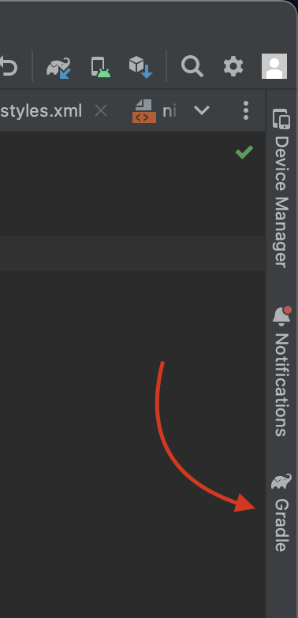
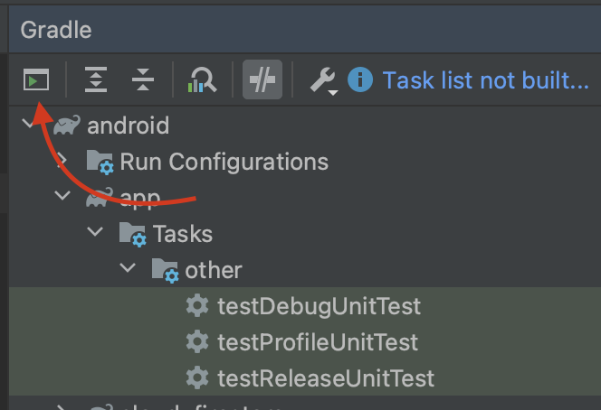
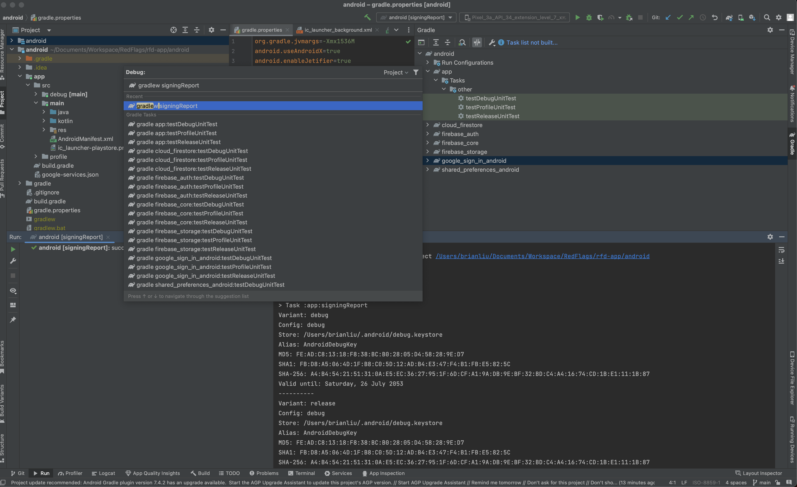
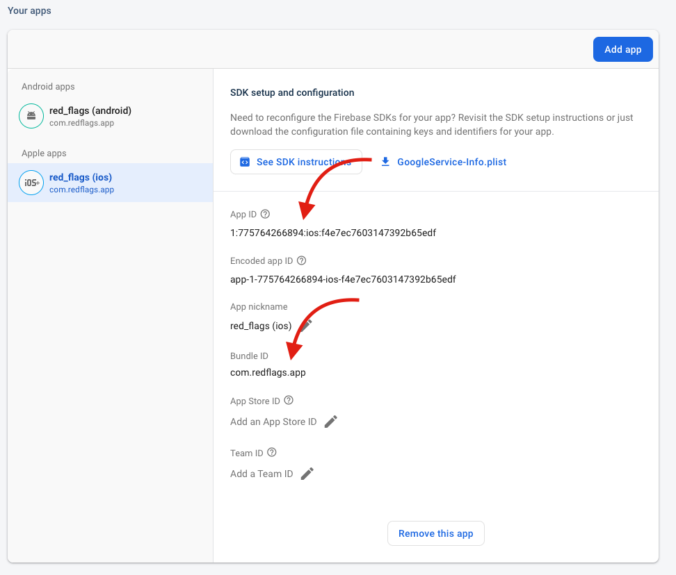
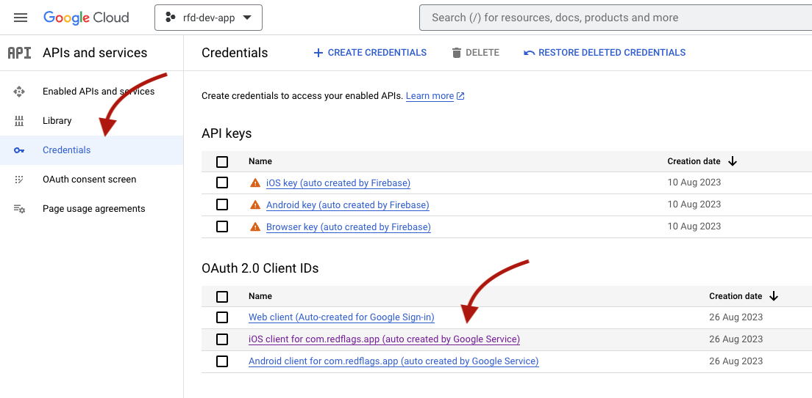
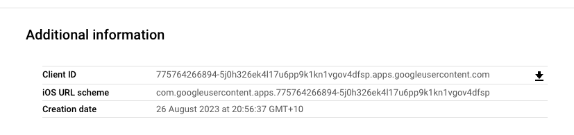

# Firebase cheat sheet

- [Authentication](#authentication)
  - [Google Sign-In](#google-sign-in)

## Authentication

### Google Sign-In

- [Set up SHA1 key](#sha1-key) *(Android Only)*
- [Set up client id](#set-up-client-id) *(iOS Only)*

> See [Federated identity & social sign-in](https://firebase.google.com/docs/auth/flutter/federated-auth#google) doc for more insight

#### `SHA1 key`

You need to ensure your machine's **SHA1** key has been configured on Firebase for using Google Sign-In with Android. There are [few different ways](https://developers.google.com/android/guides/client-auth) to get the **SHA1** of your signing certificate and using **Gradle** `signingReport` command is the easiest way for development purpose.

Open the repository in **Android Studio**, click on ***Gradle*** tab on the top-right



Click ***Execute Gradle Task*** icon



Manually type in command `gradlew signingReport` then press *Enter* then you should see different variants of certificates are output on the console as below.



Find the ***debug*** variant and copy the **SHA1**

```sh
Starting Gradle Daemon...
Gradle Daemon started in 1 s 481 ms

> Task :app:signingReport
Variant: debug
Config: debug
Store: /Users/brianliu/.android/debug.keystore
Alias: AndroidDebugKey
MD5: FE:AD:C8:13:18:F8:38:BC:B0:28:05:D4:58:28:9E:D7
SHA1: FB:D8:A5:06:4D:1F:B8:C0:5D:12:AD:B4:E3:47:F4:B1:FB:E5:82:5C
SHA-256: A4:B4:54:21:51:31:0A:E5:EC:36:27:95:1F:6D:CF:A1:9A:DB:9E:BF:32:BD:C4:A4:16:74:CD:1B:E1:11:1B:87
Valid until: Saturday, 26 July 2053
```

Go to **Firebase** console > ***Project settings*** > ***Add fingerprint*** then paste the **SHA1** key then save.


#### `Set up client id`

You can run `flutterfire configure` command to automatically update all the configurations (see [Sync Firebase configuration](../flutter/cheat-sheet.md#sync-firebase-configuration)) and only follow the below steps to manually check if you have problems to run Google Sign-In on iOS devices.


Open `ios/Runner/GoogleService-Info.plist` file and go to [Firebase console](https://console.firebase.google.com/) > ***Project settings*** > ***iOS*** app.

Ensure `GOOGLE_APP_ID` and `BUNDLE_ID` in the `GoogleService-Info.plist` are matched with the `App ID` and `Bundle ID` respectively.

```xml
<?xml version="1.0" encoding="UTF-8"?>
<!DOCTYPE plist PUBLIC "-//Apple//DTD PLIST 1.0//EN" "http://www.apple.com/DTDs/PropertyList-1.0.dtd">
<plist version="1.0">
<dict>
...
<key>BUNDLE_ID</key>
<string>com.redflags.app</string>
...
<key>GOOGLE_APP_ID</key>
<string>1:775764266894:ios:f4e7ec7603147392b65edf</string>
</dict>
</plist>
```



Go to [GCP console](https://console.cloud.google.com/) > ***API and services*** > ***Credentials*** > ***OAuth 2.0 Client IDs*** > `iOS client for com.redflags.app (auto created by Google Service)`.



Ensure `CLIENT_ID` and `REVERSED_CLIENT_ID` in the `GoogleService-Info.plist` are matched with the `Client ID` and `iOS URL scheme` respectively.

```xml
<?xml version="1.0" encoding="UTF-8"?>
<!DOCTYPE plist PUBLIC "-//Apple//DTD PLIST 1.0//EN" "http://www.apple.com/DTDs/PropertyList-1.0.dtd">
<plist version="1.0">
<dict>
<key>CLIENT_ID</key>
<string>775764266894-5j0h326ek4l17u6pp9k1kn1vgov4dfsp.apps.googleusercontent.com</string>
<key>REVERSED_CLIENT_ID</key>
<string>com.googleusercontent.apps.775764266894-5j0h326ek4l17u6pp9k1kn1vgov4dfsp</string>
...
</dict>
</plist>
```



Open `ios/Runner/Info.plist` then copy and paste the below snippet and ensure `GIDClientID` and `CFBundleURLSchemes` are matched with the `Client ID` and `iOS URL scheme` respectively.

```xml
<!-- Google Sign-in Section -->
<key>GIDClientID</key>
<string>775764266894-5j0h326ek4l17u6pp9k1kn1vgov4dfsp.apps.googleusercontent.com</string>
<key>CFBundleURLTypes</key>
<array>
  <dict>
    <key>CFBundleTypeRole</key>
    <string>Editor</string>
    <key>CFBundleURLSchemes</key>
    <array>
      <string>com.googleusercontent.apps.775764266894-5j0h326ek4l17u6pp9k1kn1vgov4dfsp</string>
    </array>
  </dict>
</array>
<!-- End of the Google Sign-in Section -->
```

> Check out more details on [google_sign_in iOS integration](https://pub.dev/packages/google_sign_in#ios-integration).
