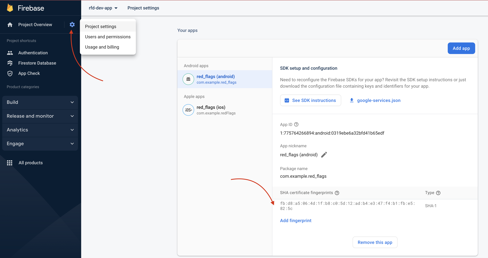

# Firebase cheat sheet

- [Authentication](#authentication)
  - [Google Sign-In](#google-sign-in)

## Authentication

### Google Sign-In

- *(Android Only)* [Set up your machine **SHA1** key for Android app on Firebase ](#sha1-key)

> See [Federated identity & social sign-in](https://firebase.google.com/docs/auth/flutter/federated-auth#google) doc for more insight

#### SHA1 key

You need to ensure your machine's **SHA1** key has been configured on Firebase for using Google Sign-In with Android. There are [few different ways](https://developers.google.com/android/guides/client-auth) to get the **SHA1** of your signing certificate and using **Gradle** `signingReport` command is the easiest way for development purpose.

Open the repository in **Android Studio**, click on ***Gradle*** tab on the top-right


Click ***Execute Gradle Task*** icon


Manually type in command `gradlew signingReport` then press *Enter* then you should see different variants of certificates are output on the console as below.


Find the ***debug*** variant and copy the **SHA1**

```sh
Starting Gradle Daemon...
Gradle Daemon started in 1 s 481 ms

> Task :app:signingReport
Variant: debug
Config: debug
Store: /Users/brianliu/.android/debug.keystore
Alias: AndroidDebugKey
MD5: FE:AD:C8:13:18:F8:38:BC:B0:28:05:D4:58:28:9E:D7
SHA1: FB:D8:A5:06:4D:1F:B8:C0:5D:12:AD:B4:E3:47:F4:B1:FB:E5:82:5C
SHA-256: A4:B4:54:21:51:31:0A:E5:EC:36:27:95:1F:6D:CF:A1:9A:DB:9E:BF:32:BD:C4:A4:16:74:CD:1B:E1:11:1B:87
Valid until: Saturday, 26 July 2053
```

Go to **Firebase** console > ***Project settings*** > ***Add fingerprint*** then paste the **SHA1** key then save.

