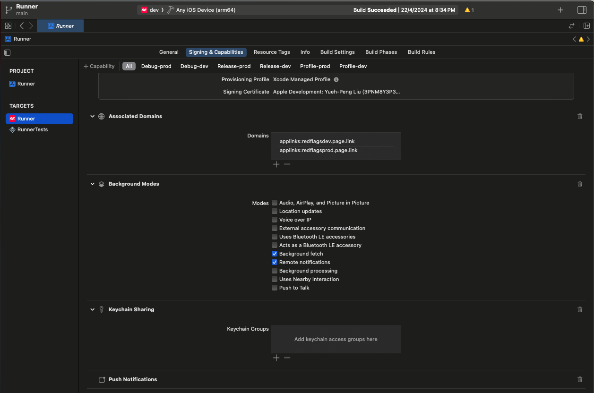
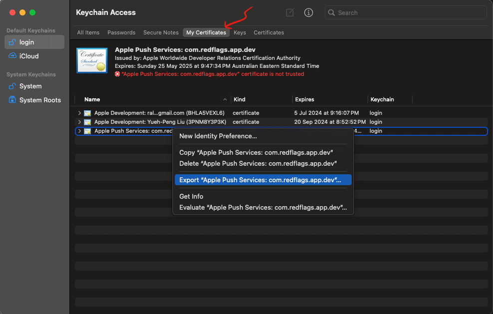
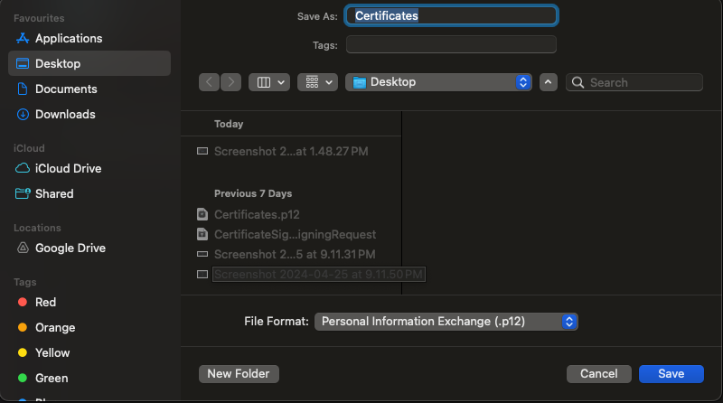

# Firebase Cloud Messaging (FCM)

Using FCM to notify (push notification) client app, [firebase_messaging](https://pub.dev/packages/firebase_messaging) plugin is required.

```bash
flutter pub add firebase_messaging
```

[flutter_local_notifications](https://pub.dev/packages/flutter_local_notifications) plugin is recommended to show notification when app is in the foreground **especially on Android** () because default notification message [will **NOT** display](https://firebase.google.com/docs/cloud-messaging/flutter/receive?hl=en&authuser=0#foreground_and_notification_messages) a visible notification. On iOS platform, displaying foreground message can be achieved by `setForegroundNotificationPresentationOptions` without needing the plugin `flutter_local_notifications`.

```dart
// For iOS to show notifications when app in foreground
FirebaseMessaging.instance.setForegroundNotificationPresentationOptions(
    sound: true,
    badge: true,
    alert: true,
);
```

> App in the ***foreground*** means when the application is **open**, **in view** and **in use**.

## Android Setup

Follow the [setup guide](https://pub.dev/packages/flutter_local_notifications#-android-setup) for `flutter_local_notifications`.

### Update `AndroidManifest.xml`

Add below snippet inside `<application>` for FCM and `flutter_local_notifications`.

```xml
        <!-- Firebase Cloud Messaging  -->
        <meta-data
            android:name="firebase_messaging_auto_init_enabled"
            android:value="false" />
        <!-- FCM default notification icon setting mainly for background message -->
        <meta-data
            android:name="com.google.firebase.messaging.default_notification_icon"
            android:resource="@drawable/ic_notification" />
        <!-- FCM default notification color setting mainly for background message -->
        <meta-data
            android:name="com.google.firebase.messaging.default_notification_color"
            android:resource="@color/rf_primary" />
        <meta-data
            android:name="firebase_analytics_collection_enabled"
            android:value="false" />
        <!-- For flutter_local_notifications -->
        <receiver android:exported="false" android:name="com.dexterous.flutterlocalnotifications.ActionBroadcastReceiver" />
        <receiver android:exported="false" android:name="com.dexterous.flutterlocalnotifications.ScheduledNotificationReceiver" />
        <receiver android:exported="false" android:name="com.dexterous.flutterlocalnotifications.ScheduledNotificationBootReceiver">
            <intent-filter>
                <action android:name="android.intent.action.BOOT_COMPLETED"/>
                <action android:name="android.intent.action.MY_PACKAGE_REPLACED"/>
                <action android:name="android.intent.action.QUICKBOOT_POWERON" />
                <action android:name="com.htc.intent.action.QUICKBOOT_POWERON"/>
            </intent-filter>
        </receiver>
```

Add below snippet inside `<manifest>`.

```xml
<!-- Permissions options to know device is rebooted for flutter_local_notifications -->
<uses-permission android:name="android.permission.RECEIVE_BOOT_COMPLETED"/>
<!-- Permissions options for flutter_local_notifications -->
<uses-permission android:name="android.permission.SCHEDULE_EXACT_ALARM" />
<uses-permission android:name="android.permission.USE_EXACT_ALARM" />
```

### Create notification icon using Android Studio

Follow the [official guide](https://developer.android.com/studio/write/create-app-icons).

## iOS Setup

### Enable iOS capabilities

Follow the official [guide](https://firebase.google.com/docs/cloud-messaging/flutter/client?hl=en&authuser=0).



### Upload APNs certificate `.p12`

Follow the official [guide](https://firebase.google.com/docs/cloud-messaging/flutter/client?hl=en&authuser=0#upload_your_apns_authentication_key) and this [step-by-step article](https://medium.com/plus-minus-one/configure-firebase-push-notification-f0e9f035c81b). Note that Firebase requires `.p12` certificate, follow the the steps

- Create a [CSR](https://developer.apple.com/help/account/create-certificates/create-a-certificate-signing-request) (Certificate Signing Request) using ***Keychain Access***
- Create a [APNs certificate](https://developer.apple.com/account/resources/certificates/add) using the above CSR
- Download the APNs certificate
- Double click it to open it in ***Keychain Access*** -> ***My Certificates*** in order to export as `.p12` certificate.




## Flutter Setup

More details of FCM initialization in `main_init.dart`.

## Localization

See the [official guide](https://firebase.google.com/docs/cloud-messaging/flutter/receive?hl=en&authuser=0#localize_messages) and [README](https://github.com/CrossGeeks/FirebasePushNotificationPlugin/blob/master/docs/LocalizedFirebasePushNotifications.md).
