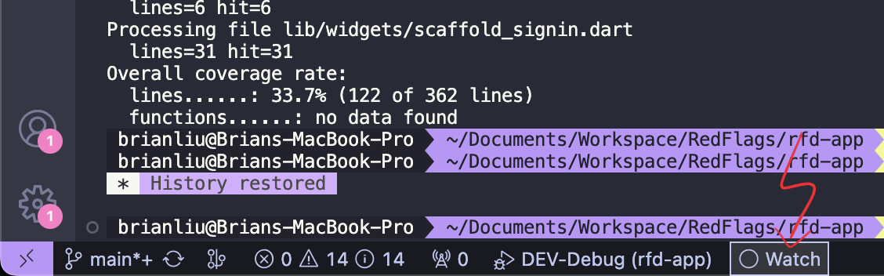
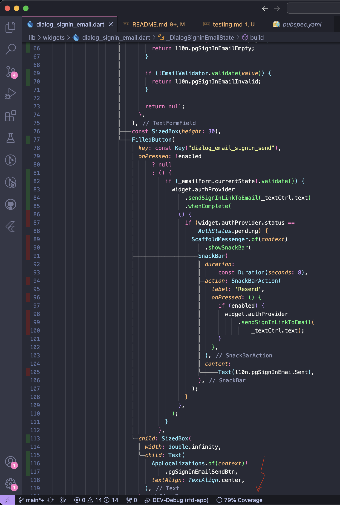

# Testing

- [Run Test](#run-test)
- [Coverage in VS Code](#coverage-in-vs-code)

```yml
    .
    ├── coverage/                         # Test coverage report
    │   ├── Icov.info                     # Generated via "flutter test --coverage"
    │   ├── index.html                    # Generated via "genhtml coverage/lcov.info -o coverage"
    │   ├── ...                           
    └── ...
```

## Run test

Run test with/without coverage report (generates `Icov.info` file)

```bash
flutter test
flutter test --coverage
```

then convert `Icov.info` to `index.html` to view on browser

```bash
genhtml coverage/lcov.info -o coverage
open coverage/index.html
```

## Coverage in VS Code

Click **Coverage Gutters** on the status bar to show testing coverage.



When open a *dart* file, it will show the coverage percentage on the status bar and highlight with green/red to indicate touched/untouched lines.

