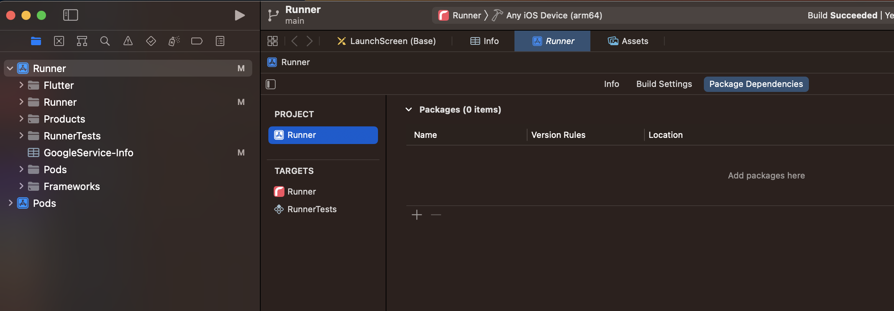

# iOS cheat sheet

- [(Xcode) Change the app icon and launch screen](#change-the-app-icon-and-launch-screen)
- [(Xcode) Add/Remove dependency packages](#addremove-dependency-packages)
- [CocoaPods dependency](#cocoapods-dependency)
- [Image usage description](#image-usage-description)

## Change the app icon and launch screen

1. Use [appiconmaker](https://appiconmaker.co/) or [Icon Set Creator](https://stackoverflow.com/questions/43928702/how-to-change-the-application-launcher-icon-on-flutter) to generate all versions of icon from the source image. For non-square image asset, use [Icon Slayer](https://www.gieson.com/Library/projects/utilities/icon_slayer/) instead with **SVG** file.

2. Open the repo folder in **Xcode**, then go to `Runner > Asset`


3. Drag & drop the versions of icon accordingly to replace the icons (e.g. `Icon-40.png` should goes to `2x of 20pt`)

## Add/Remove dependency packages

Open **Xcode** and select ***Runner*** > ***PROJECT - Runner*** > ***Package Dependencies*** tab.



## CocoaPods Dependency

Sometimes adding **Flutter** dependency via `flutter pub add xxx` command, it requires to update **CocoaPods** dependency as well for **iOS** as it might cause build fail. Simply just change into `ios/` folder then run `pod install` to update `Podfile.lock`.

```bash
cd ios
pod install
```

## Image usage description

As part of **iOS** security requirements to access photo library and camera on device, the `NSPhotoLibraryUsageDescription` and `NSCameraUsageDescription` need to be set in the `Info.plist` to elaborate the purpose of accessing which will be prompted to users for context and consent.

```plist
<key>NSPhotoLibraryUsageDescription</key>
<string>Allow Red Flags to access the photo library on this device in order to select a photo for displaying on your profile.</string>
<key>NSCameraUsageDescription</key>
<string>Allow Red Flags to access the camera on this device in order to take a photo for displaying on your profile.</string>
```