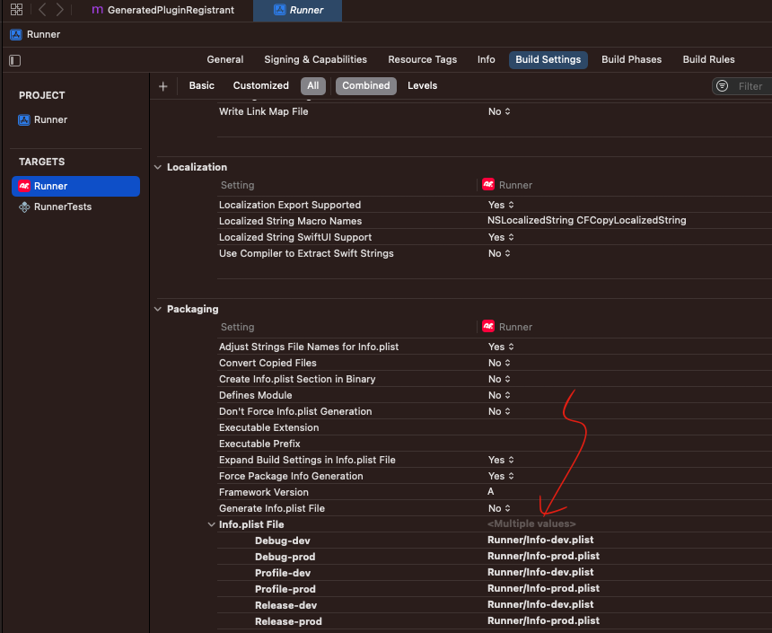
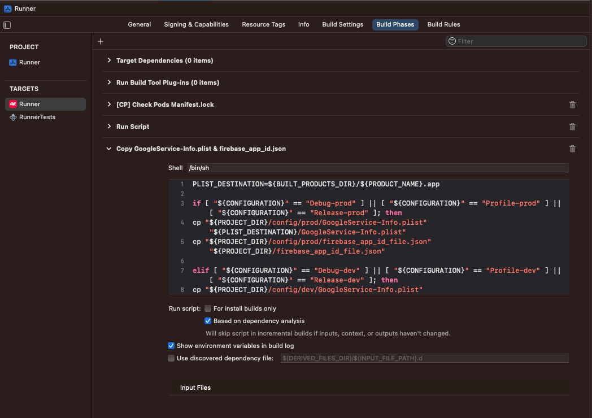

# Environments

**iOS** requires more manual settings to support different flavors (environments), ensure changes are manually update to the files accordingly. See more details about *Android*, *Firebase* and *Flutter* flavors.

- [Flutter flavors](/docs/flutter/environments.md)
- [Firebase environments](/docs/firebase/environments.md)
- [Android product flavors](/docs/android/environments.md)

```yml
    .
    ├── ios/    
    │   ├── Podfile
    │   ├── Runner.xcodeproj/    
    │   │   ├── project.pbxproj/
    │   │   └── xcshareddata/
    │   │       └── xcschemes/
    │   │           ├── dev.xcscheme
    │   │           └── prod.xcscheme
    │   ├── config/
    │   │   ├── dev/      
    │   │   │   ├── firebase_app_id_file.json
    │   │   │   └── GoogleService-Info.plist
    │   │   └── prod/      
    │   │       ├── firebase_app_id_file.json
    │   │       └── GoogleService-Info.plist
    │   └── Runner/
    │       ├── Info-dev.plist
    │       └── Info-prod.plist
    │
    └── ...
```

## `{flavor}.xcscheme`

Follow the [Create flavors in iOS](https://docs.flutter.dev/deployment/flavors#creating-flavors-in-ios) to create new scheme and duplicate ***Debug***, ***Profile*** and ***Release*** build mode configurations via **Xcode**, `{flavor}.xcscheme` files will be generated by **Xcode**.

## `Podfile`

`project` section need to update to match the schemes' configurations.

```pod
project 'Runner', {
  'Debug-prod' => :debug,
  'Profile-prod' => :release,
  'Release-prod' => :release,
  'Debug-dev' => :debug,
  'Profile-dev' => :release,
  'Release-dev' => :release,
}
```

## `Info-{flavor}.plist`

**Xcode** default reads `ios/Runner/Info.plist`, so need to manually set the it to read different files based on configuration's flavor.




## `firebase_app_id_file.json` and `GooogleService-Info.plist`

A customized build script is added under ***Build Phases*** via **VS Code** to copy these two files during build time accordingly bases on the flavor.

